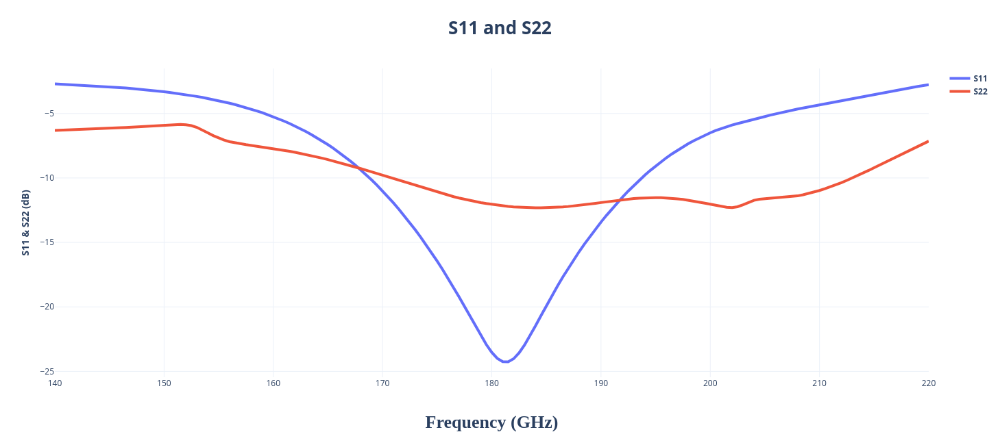

Design data and design process description
############################################

Schematic: Qucs-s 25.1.2

Simulator: Ngspice 44.2

**Simulated Small Signal Gain:**

.. image:: _static/S21.png
    :align: center
    :alt: S-parameters Image.
    :width: 800

**S21 and S22:**   

